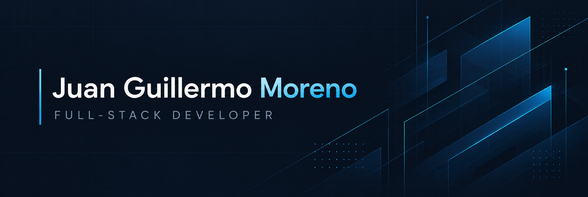
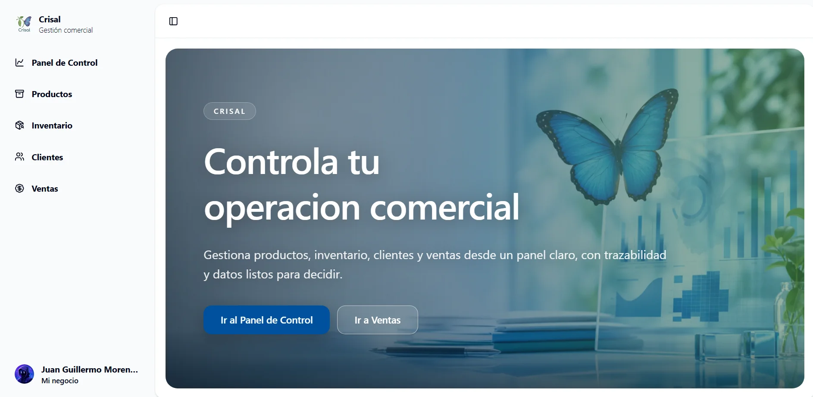
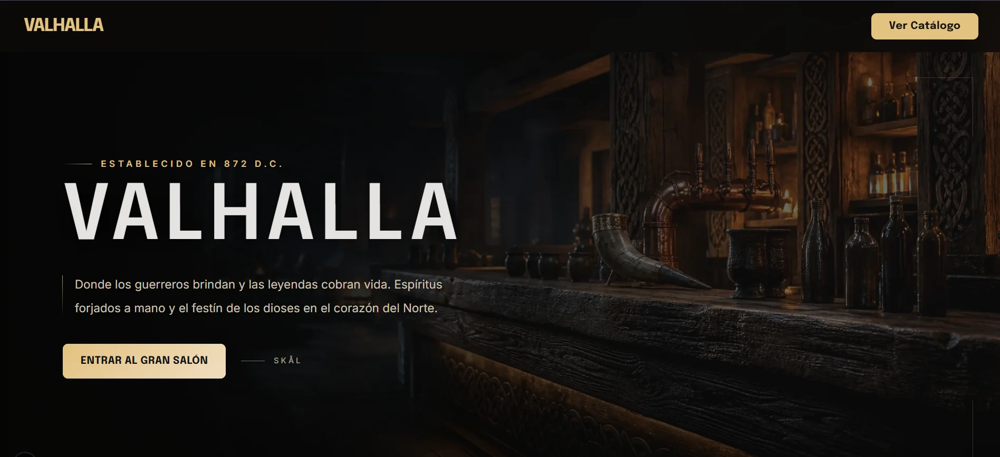
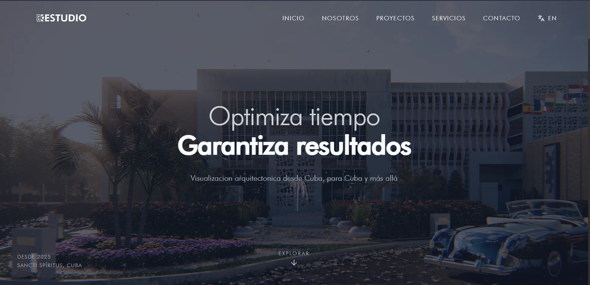

  <picture>
    <source media="(prefers-color-scheme: dark)" srcset="https://readme-typing-svg.demolab.com/?font=Fira+Code&amp;size=19&amp;duration=2800&amp;pause=1200&amp;color=38BDF8&amp;center=true&amp;vCenter=true&amp;width=650&amp;height=45&amp;lines=APIs+robustas+%C2%B7+interfaces+accesibles;Del+modelado+de+datos+al+despliegue" />
    
  </picture>

Soy **ingeniero en Ciencias Informáticas** y desarrollador **full-stack**. Construyo productos web de extremo a extremo: desde el modelado de datos y las APIs hasta interfaces claras y accesibles. Me importan la arquitectura mantenible y que el software resuelva problemas reales.

  <a href="https://mi-portafolio-bay-eta.vercel.app/es">Portafolio ES</a> ·
  <a href="https://mi-portafolio-bay-eta.vercel.app/en">Portfolio EN</a> ·
  <a href="https://mi-portafolio-bay-eta.vercel.app/docs/CV_Juan_Guillermo_Moreno.pdf">CV ES</a> ·
  <a href="https://mi-portafolio-bay-eta.vercel.app/docs/CV_Juan_Guillermo_Moreno_EN.pdf">CV EN</a> ·
  <a href="https://www.linkedin.com/in/juan-guillermo-moreno-galvez-9a42a7330/">LinkedIn</a> ·
  <a href="mailto:juguimo16@gmail.com">Contacto</a>

## Trabajo seleccionado

### Crisal · gestión comercial full-stack

Sistema para un negocio de venta directa que reúne productos, clientes, ventas e inventario. Desarrollé la aplicación y una API REST por capas con autenticación JWT; la lógica de stock por lotes conserva la trazabilidad incluso al anular una venta.

**Stack:** Next.js, TypeScript, Node.js, Express y PostgreSQL.

[Ver aplicación](https://crisal-bi-gestion-de-venta-directa.vercel.app) · [Explorar código](https://github.com/JuanGMoreno/Crisal_Bi_Gestion_de_venta_directa)

### Valhalla · experiencia web para restauración

Diseñé e implementé el frontend de esta experiencia para un bar-restaurante. Incluye una capa de servicios que permite trabajar con datos de prueba o una API, estados de carga y error, y animaciones que respetan la preferencia de movimiento reducido.

**Stack:** Next.js, TypeScript, Tailwind CSS y Motion.

[Ver aplicación](https://fron-end-valhalla.vercel.app/) · [Explorar código](https://github.com/JuanGMoreno/fron-end-Valhalla)

### BK-Studio · colaboración frontend

Sitio bilingüe para presentar proyectos de arquitectura y renders. Sobre una base de código existente, contribuí con secciones nuevas, corrección de errores y el despliegue; la experiencia incluye una galería interactiva.

**Stack:** React, TypeScript, Tailwind CSS y Vite.

[Ver aplicación](https://bk-studio-bay.vercel.app/) · [Explorar código](https://github.com/JuanGMoreno/BK-Studio)

## Herramientas con las que trabajo

**Frontend** · React, Next.js, TypeScript, Tailwind CSS

**Backend y datos** · Node.js, NestJS, Express, PostgreSQL, Prisma

**Cloud y herramientas** · AWS, Docker, Git

## Experiencia

- **Soluciones Nimrod · desarrollador full-stack** (jun. 2025 – jul. 2026). Colaboré en un equipo remoto de producto empresarial, desarrollando interfaces con React y Next.js, integrando APIs REST y trabajando con servicios de AWS. Uno de los productos relacionados es **Taskrod**; su código no es público.
- **Freelance · desarrollador full-stack** (ene. 2023 – ene. 2024). Desarrollé soluciones para clientes desde los requisitos hasta el despliegue, entre ellas Crisal, y colaboré en BK-Studio.

Puedes ampliar el contexto de cada proyecto y mi trayectoria en el [portafolio](https://mi-portafolio-bay-eta.vercel.app/es#experience).

## Hablemos

Estoy abierto a oportunidades y colaboraciones donde pueda aportar tanto en backend como en frontend. Puedes escribirme a [juguimo16@gmail.com](mailto:juguimo16@gmail.com) o contactar conmigo por [LinkedIn](https://www.linkedin.com/in/juan-guillermo-moreno-galvez-9a42a7330/).
